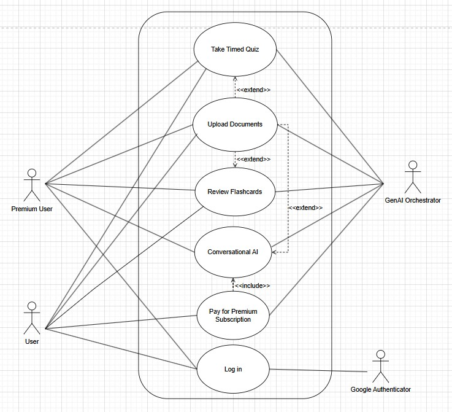
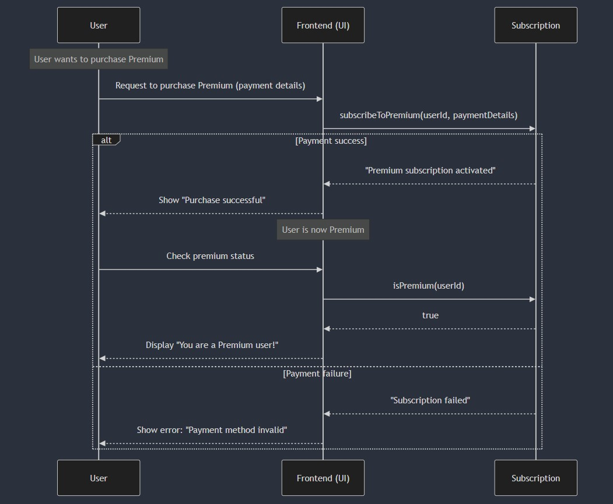

# M3 - Requirements and Design

## 1. Change History
<!-- Leave blank for M3 -->

## 2. Project Description

Thinkr is an Android mobile app that is geared towards helping students study through AI-generated multiple-choice quizzes and notes. Students can create and share quizzes/notes with other users.

## 3. Requirements Specification

### **3.1. Use-Case Diagram**


### **3.2. Actors Description**

1. **Regular users**: Can only access the Flashcards feature and the Quiz feature.
2. **Premium users**: Can ask questions to an AI assistant about their uploaded documents along with the features normal students can use.

Note: Users and Students will be used synonymously in this document.

### **3.3. Functional Requirements**

1. **Account Setup** 
    - **Description**: Users can create an account and log in.
    - **Primary actor(s)**: Premium and regular students.
    - **Main success scenario**:
        - Users are able to create accounts and are able to log in to the account they just created.
    - **Failure scenario(s)**:
        - Users create an account and are unable to log into the account that they tried to create.
            - An error message is displayed on the screen telling them login was unsuccessful.

2. **Premium Subscription** 
    - **Description**: Users can pay for a premium subscription for more features.
    - **Primary actor(s)**: Premium and regular users.
    - **Main success scenario**:
        - User successfully completes their purchase and obtains premium status.
        - User’s billing cycle is accurate.
    - **Failure scenario(s)**:
        - User’s payment method fails.
            - Shows an error screen and asks the user to check if the payment card is valid.

3. **Document Uploads**
    - **Description**: Users can upload documents to the application for parsing. Supported formats are PDF or image.
    - **Primary actor(s)**: Regular and Premium Users.
    - **Main success scenario**:
        - User successfully uploads the document and is able to access the main features (Chat, Notes, Flashcards, Quiz).
    - **Failure scenario(s)**:
        - File upload fails, and user is unable to access the main features (Chat, Notes, Flashcards, Quiz).
            - If the upload failed due to network errors, show a message asking user to check their connection.
            - If the format of the document is not supported, show a message asking user to check their file format.

4. **Conversational AI (regarding the documents uploaded)**
    - **Description**: Premium users can chat with the AI about the documents they have uploaded.
    - **Primary actor(s)**: Premium Users.
    - **Main success scenario**:
        - The AI returns context-aware responses in the chat.
        - The AI understands the information of the uploaded documents.
    - **Failure scenario(s)**:
        - App fails to return a response because of the Network Error.
            - Show a message asking user to check their connection.
        - User’s message exceeds the context length limit.
            - Disable the send button, and user cannot send until they shorten their input.

5. **Review Flashcards**
    - **Description**: Users can browse and interact with AI-generated flashcards.
    - **Primary actor(s)**: Regular and Premium Users.
    - **Main success scenario**:
        - Flashcards are generated based on the documents we have provided.
    - **Failure scenario(s)**:
        - Flashcards are not generated due to errors.
            - Asks user to upload or try again.

6. **Timed Quiz**
    - **Description**: Users can take a timed, multiple-choice quiz based on the documents uploaded.
    - **Primary actor(s)**: Regular and Premium Users.
    - **Main success scenario**:
        - Multiple choice quizzes are generated based on the documents provided.
    - **Failure scenario(s)**:
        - AI fails to generate a quiz because it was unable to parse the document.
            - Tells the user to try again, by either clicking the button or uploading the docs.

### **3.4. Screen Mockups**


### **3.5. Non-Functional Requirements**

1. **Quiz/flashcard generation performance**
    - **Description**: The amount of time it takes to generate a quiz or a flashcard via documents must take no longer than 10 seconds.
    - **Justification**: This is relevant to user experience as faster response times keep them more engaged with our app and can proceed with their studying quicker. Slow response times may result in users not wanting to interact with our app as much.

2. **Responsive UI/UX**
    - **Description**: Use loading animations for the time that the app is waiting for.
    - **Justification**: Loading animations should be used when to promote engaging and intuitive user experiences. These should be used when a user is uploading their document or waiting for a chat reply.

## 4. Designs Specification

### **4.1. Main Components**

1. **UserService**
    - **Purpose and rationale**: Encapsulates functionalities related to users such as account creation, authentication, and login.

2. **DocumentService**
    - **Purpose and rationale**: Encapsulates functionalities related to documents such as adding, modifying, or deleting.

3. **Subscription**
    - **Purpose and rationale**: Handles user subscriptions to differentiate regular and premium users.

4. **Chat**
    - **Purpose and rationale**: Encapsulates functionalities related to message streaming with the chatbot trained on the selected document's context such as creating a session and receiving/sending messages.

5. **DocumentParser**
    - **Purpose and rationale**: Extract text from the document into embeddings and store into vector database.

6. **RAGService**
    - **Purpose and rationale**: Fetches documents from the vector database and prompts LLM with query + relevant context.

7. **FlashcardsQuizGenerator**
    - **Purpose and rationale**: Use the parsed document to generate and format flashcards and quizzes for the frontend.

### **4.2. Databases** TODO: maybe delete

1. **User**
    - **Purpose**: Used to persist and relate user information such as account information and its related documents.
2. **Document**
    - **Purpose**: Used to persist documents related to a user.
3. **Chat**
    - **Purpose**: Used to persist chat sessions for each user and related documents.

### **4.3. External Modules**

1. **Google Authentication** 
    - **Purpose**: Facilitating user login.

2. **LLM API: OpenAI or DeepSeek**
    - **Purpose**: Used for the chat-with-document feature, and for generating the quiz and flashcards.

### **4.4 Interfaces**

1. **UserService**

    ```java
    /**
     * Invoked when user signs up to create a new account.
     *
     * @param username the username of the new account
     * @param password the password of the new account
     * @return a Result object indicating the success or failure of the operation
     */
    Result signUp(String username, String password);

    /**
     * Invoked when user signs in with an existing account.
     *
     * @param username the username of the existing account
     * @param password the password of the existing account
     * @return a Result object indicating the success or failure of the operation
     */
    Result signIn(String username, String password);
    ```

2. **DocumentService**

    ```java
    /**
     * Invoked when user adds a new document.
     *
     * @param document the document to be added
     * @return a Result object indicating the success or failure of the operation
     */
    Result createDocument(Document document);

    /**
     * Invoked when user deletes an existing document.
     *
     * @param document the document to be deleted
     * @return a Result object indicating the success or failure of the operation
     */
    Result deleteDocument(Document document);

    /**
     * Invoked when user edits an existing document.
     *
     * @param document the document to be edited
     * @return a Result object indicating the success or failure of the operation
     */
    Result editDocument(Document document);

    /**
     * Invoked when user views an existing document.
     *
     * @param id the id of the document to be viewed
     * @return the Document object corresponding to the given id
     */
    Document viewDocument(int id);
    ```

3. **Subscription**

    ```java
    /**
     * Invoked to check a boolean flag of the user to get the premium status.
     *
     * @param userId the id of the user
     * @return a boolean indicating whether the user is a premium user
     */
    Boolean isPremium(int userId);
    ```

4. **Chat**

    ```java
    /**
     * Invoked when user creates a chat session.
     *
     * @return a Result object indicating the success or failure of the operation
     */
    Result createChat();

    /**
     * Invoked when user sends a message/prompt.
     *
     * @param message the message to be sent
     * @return a Result object indicating the success or failure of the operation
     */
    Result sendMessage(String message);

    /**
     * Invoked when chatbot streams a message to the user.
     *
     * @param message the message received from the chatbot
     * @return a Result object indicating the success or failure of the operation
     */
    Result receiveMessage(String message);
    ```

5. **DocumentParser**

    ```java
    /**
     * Generates embeddings from the extracted text and stores them in the vector database.
     *
     * @param document the document to be parsed
     * @return a ParsedDocument object containing the extracted information
     */
    ParsedDocument extractInformation(Document document);
    ```

6. **RAGService**

    ```java
    /**
     * Fetches documents from the vector database relevant to the given query.
     *
     * @param query the query to search for relevant documents
     * @return a list of Document objects relevant to the query
     */
    List<Document> fetchRelevantDocuments(String query);

    /**
     * Prompts the LLM API with the provided context/documents and query.
     *
     * @param query the query to be sent to the LLM
     * @param contextDocuments the list of context documents to be provided to the LLM
     * @return a string response from the LLM
     */
    String queryLLM(String query, List<Document> contextDocuments);
    ```

7. **FlashcardsQuizGenerator**

    ```java
    /**
     * Uses the parsed document to generate flashcards.
     *
     * @param document the document to generate flashcards from
     * @return a list of Flashcard objects generated from the document
     */
    List<Flashcard> generateFlashcards(Document document);

    /**
     * Uses the parsed document to generate a quiz.
     *
     * @param document the document to generate a quiz from
     * @return a Quiz object generated from the document
     */
    Quiz generateQuiz(Document document);

    /**
     * Formats the extracted data into a JSON to send to the frontend.
     *
     * @param quiz the quiz object to be formatted
     * @return a string containing the formatted quiz in JSON
     */
    String formatQuiz(Quiz quiz);

    /**
     * Formats a list of flashcards to send to the frontend.
     *
     * @param flashcards the list of flashcards to be formatted
     * @return a string containing the formatted flashcards in JSON
     */
    String formatFlashcards(List<Flashcard> flashcards);
    ```

### **4.5. Frameworks**

1. **AWS (Textract and EC2)**
    - **Purpose**: Used for deployment and extracting text from files.
    - **Reason**: AWS provides easy to access OCR tools and a quick way to deploy our backend onto the cloud.

2. **LangChain**
    - **Purpose**: For constructing input and output of RAG.
    - **Reason**: LangChain is one of the only services that can do vector comparison of the embeddings.

3. **Node.js**
    - **Purpose**: Used for backend development.
    - **Reason**: Node.js allows for efficient development of backend web services with TypeScript.

4. **Express.js**
    - **Purpose**: Used for backend development in the Node.js runtime environment.
    - **Reason**: Express.js allows for efficient development of REST APIs in the Node.js runtime environment.

5. **Jetpack Compose**
    - **Purpose**: Used for Android UI development.
    - **Reason**: Jetpack Compose allows for declarative implementation of UI in Kotlin for better maintainability, ease of UI testing with Compose testing, and intuitive use of Kotlin APIs.

6. **Retrofit**
    - **Purpose**: Type-safe HTTP Client for the JVM.
    - **Reason**: Retrofit allows us to consume REST APIs from the Android app to build scalable API calls.

7. **Ktor**
    - **Purpose**: Ktor WebSocket Client can be used to enable the real-time chat functionality with the chatbot.
    - **Reason**: Ktor integrates nicely with Kotlin APIs.

8. **MongoDB**
    - **Purpose**: Storing user account information.
    - **Reason**: Flexible NoSQL database that can be easily used for different scenarios.

9. **ChromaDB**
    - **Purpose**: To store the vector embeddings of the documents.
    - **Reason**: It is inexpensive, efficient, and easy to use.

### **4.6. Dependencies Diagram**

TODO

### **4.6. Functional Requirements Sequence Diagram**
1. [**[Account Setup]**](#fr1)\


2. [**[Premium Subscription]**](#fr1)\


3. [**[Document Uploads]**](#fr1)\


### **4.7. Non-Functional Requirements Design**
1. [**[Quiz/flashcard generation performance]**](#nfr1)
    - **Validation**: We will implement a fan out pattern for extracting text from files by multithreading text extraction for each page (extract multiple pages at the same time). Also, while the user is providing information about the document, we will start uploading the document in the background so that the back-end can start parsing earlier to make quiz/flashcard generation appear a lot faster.
2. [**[Responsive UI/UX]**](#nfr1)
    - **Validation**: We will create loading animations for different front-end components, specifically for when the user is waiting for the document to be uploaded and parsed, or waiting for a reply from the back-end.

### **4.8. Main Project Complexity Design**
**[WRITE_NAME_HERE]**
- **Description**: ...
- **Why complex?**: ...
- **Design**:
    - **Input**: ...
    - **Output**: ...
    - **Main computational logic**: ...
    - **Pseudo-code**: ...
        ```
        
        ```


## 5. Contributions

- **Ray Ho**
    - Writing requirement specifications (actors, functional and non-functional requirements)
    - Creating the use case diagram
    - Creating sequence diagrams for case functional requirements 1-3
    - Coming up with some frameworks, components and interfaces for those components

- **Parshan Javanrood**
    - TODO

- **Jaiden Siu**
    - Worked on design specifications of main components, interfaces, and tech stack
    - Refined components, tech stack, and user requirements to ensure scaleable design
    - Created design diagram
    - Participated in frontend design and mockups discussions

- **Anthony Ji**
    - TODO